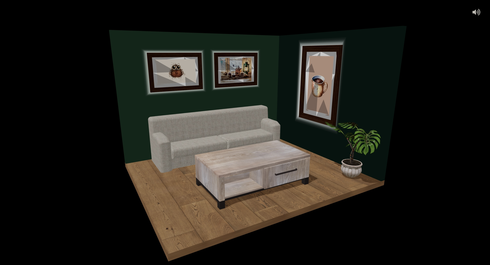

# Interactive 3D Room with Three.js 🏠

A simple interactive 3D room built with Three.js, featuring picture frames, ambient lighting, and a few carefully placed models. This project explores shader effects, camera interactions, and optimized asset loading for a smooth experience.


---

## Features

- **Interactive Picture Frames** ✨
  Frames on the wall glow using Three.js shaders and are interactable. Clicking zooms the camera in on the image, and clicking again resets the view using GSAP.

- **Realistic Floor Texture** 🖼️ 
  A wood texture applied to the floor, which also receives shadows for a more immersive environment.

- **Smooth Loading Experience** ⏳
  A loading screen created using Three.js shaders, where `uAlpha` decreases as meshes mount, combined with a loading bar that visually tracks progress.

- **Ambient Music** 🎶
  Background music plays in the scene with a button to toggle it on and off.

- **Optimized Loading Management** 🚀
  Zustand's loading manager ensures assets load properly while updating the UI accordingly.

## Technologies Used

- **Three.js**  
  For rendering the 3D environment.

- **GSAP**  
  For smooth camera animations when interacting with frames.

- **Zustand**  
  For managing loading states and application state.

- **React Three Fiber**  
  For integrating Three.js with React.

- **Shaders**  
  Used for the glowing frame effect and loading screen transitions.

## Getting Started

1. Clone this repository:
   ```bash
   git clone https://github.com/psaemiyan/gallery.git

2. Navigate to the project directory:
    ```bash
    cd gallery

3. Install dependencies:
    ```bash
    npm install

4. Start the development server:
    ```bash
    npm run dev 